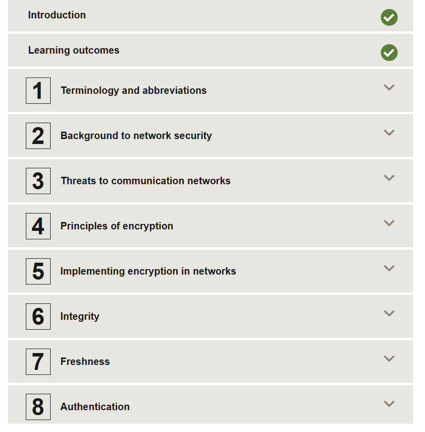
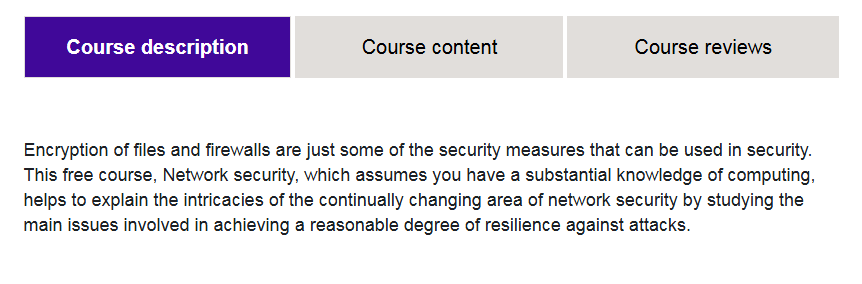
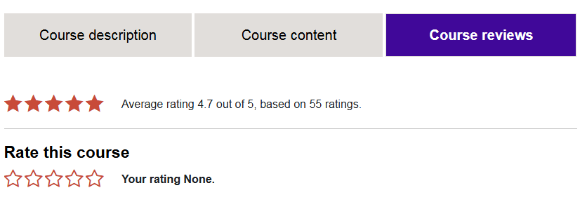

# 🛡️ OpenLearn – Network Security

This repository contains **notes, labs, demos, guides, case studies, and certificate of completion** for the *OpenLearn – Network Security* program. The course covers essential concepts in **network security, secure architecture, threat detection, incident response, and advanced network protection techniques**.

---

## 📚 Notes
- 📄 [01-introduction.md](./notes/01-introduction.md) – Introduction to Network Security  
- 📄 [02-network-fundamentals.md](./notes/02-network-fundamentals.md) – Networking basics  
- 📄 [03-firewalls-vpn-ids-ips.md](./notes/03-firewalls-vpn-ids-ips.md) – Firewalls, VPNs, IDS/IPS  
- 📄 [04-network-threats.md](./notes/04-network-threats.md) – Common network threats  
- 📄 [05-secure-network-design.md](./notes/05-secure-network-design.md) – Secure network architecture  
- 📄 [06-monitoring-incident-response.md](./notes/06-monitoring-incident-response.md) – Monitoring & incident response  
- 📄 [07-advanced-topics.md](./notes/07-advanced-topics.md) – Advanced network security concepts

---

## 🧪 Labs
- 🔧 [01-firewall-configuration.md](./labs/01-firewall-configuration.md) – Firewall setup and rules  
- 🔧 [02-vpn-setup.md](./labs/02-vpn-setup.md) – VPN configuration  
- 🔧 [03-ids-ips-deployment.md](./labs/03-ids-ips-deployment.md) – IDS/IPS deployment  
- 🔧 [04-network-monitoring.md](./labs/04-network-monitoring.md) – Network monitoring exercises  
- 🔧 [05-ddos-simulation.md](./labs/05-ddos-simulation.md) – DDoS simulation and mitigation

---

## 💻 Demo
- 📄 [demo-examples01.md](./demo/demo-examples01.md) – Basic firewall rules demo  
- 📄 [demo-examples02.md](./demo/demo-examples02.md) – VPN client connection demo  
- 📄 [demo-examples03.md](./demo/demo-examples03.md) – IDS/IPS alert simulation demo

---

## 📋 Guides
- 📄 [setup-lab-environment.md](./guides/setup-lab-environment.md) – Lab setup instructions  
- 📄 [incident-response-guidelines.md](./guides/incident-response-guidelines.md) – Incident response best practices  
- 📄 [threat-mitigation-strategies.md](./guides/threat-mitigation-strategies.md) – Network threat mitigation strategies

---

## 🔬 Extras
- 📑 [case-studies.md](./extras/case-studies.md) – Analysis of major network security incidents  
- 📑 [resources.md](./extras/resources.md) – Additional references and reading materials  
- 📆 [timeline.md](./extras/timeline.md) – Timeline of significant network attacks

---

## 📖 Docs
- 📘 [index.md](./docs/index.md) – Program overview  
- 📘 [glossary.md](./docs/glossary.md) – Network security glossary  
- 📘 [references.md](./docs/references.md) – External references  
- 📘 [roadmap.md](./docs/roadmap.md) – Learning roadmap  
- 📘 [syllabus.md](./docs/syllabus.md) – Course syllabus

---

## 📸 Screenshots

| Step | Screenshot |
|-------------------------|------------|
| 📚 Course Content |  |
| 🏫 Course Overview |  |
| ⭐ Course Reviews |  |

---

## 📜 Certificate
🎓 [OpenLearn Network Security](./cert/OpenLearn%20Network%20security.pdf)

---

## 📝 Personal Review
This course provides a solid foundation in **network security concepts, threat mitigation, and practical defense techniques**.  
Hands-on labs and demos help understand **firewalls, VPNs, IDS/IPS deployment, network monitoring, and DDoS mitigation**.  
It is ideal for learners seeking practical skills to **secure networks and respond to incidents effectively**.

---

## ✍️ Author
**Thành Danh** – Red Team Learner & Security Researcher  

- GitHub: [@ngvuthdanhh](https://github.com/ngvuthdanhh)  
- Email: ngvu.thdanh@gmail.com  

---

## 📄 License
This project is licensed under the terms of the **MIT License**. See [LICENSE](./LICENSE) for full details.  
© 2025 ngvuthdanhh. All rights reserved.
